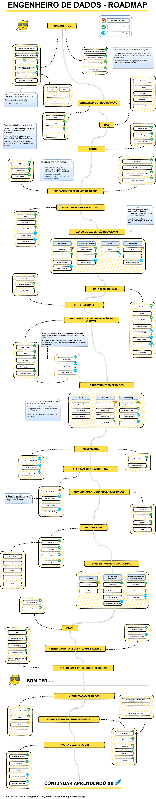

***
## Referencia 🔥

- **Este projeto é um fork: https://github.com/datastacktv/data-engineer-roadmap** 

> O desenho é semelhante ao do projeto original
> 
> Os textos foram traduzidos para o português

***

> Roteiro para se tornar um engenheiro de dados em 2021

Este roteiro visa fornecer uma **imagem completa do cenário moderno da engenharia de dados** e servir como um **guia de estudo** para aspirantes a engenheiros de dados.

***

<h3 align="center"><strong>Nota para Iniciantes</strong></h3>

> Os iniciantes não devem se sentir oprimidos pelo vasto número de ferramentas e estruturas listadas aqui. Um engenheiro de dados típico dominaria um subconjunto dessas ferramentas ao longo de vários anos, dependendo de sua empresa e opções de carreira.

***

[comment]: <> (🔥  We just launched [**Data Stack Jobs**]&#40;https://datastackjobs.com/&#41; — a clean and simple job site for Data Stack Engineers!)

[comment]: <> (> [Text version for visually impaired users]&#40;text/roadmap.md&#41;)

## Contribuições são bem-vindas 💜

Levante um problema para discutir suas sugestões ou abra um `Pull Request` para solicitar melhorias.

## Reviewers 🔎

[comment]: <> (Huge thank you to [@whydidithavetobebugs]&#40;https://github.com/whydidithavetobebugs&#41;, [@sawidis]&#40;https://github.com/sawidis&#41;, [@marclamberti]&#40;https://github.com/marclamberti&#41; and [@mpyeager]&#40;https://github.com/mpyeager&#41; for reviewing this roadmap.)

## Licença 🗞

> Copyright © 2021 
